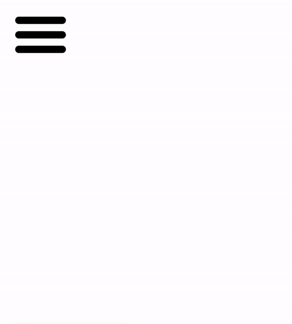

## KleurenToggle App
Een app waarmee je de achtergrondkleur van je webpagina kunt veranderen door middel van een keuze-menu.

###### Clone of download het project van Github. Je kunt gelijk starten door index.html te openen.

### Project doel
Het doel van het project is om vertrouwd te raken met Vanilla Javascript, DOM manipulatie en HTML/CSS. De app is gemaakt in de eerste week van de opleiding.

### Project eisen
- [x] Als gebruiker wil ik op een hamburger-icoon kunnen klikken dat uitklapt als ik er op klik.
- [x] Als gebruiker wil ik in het uitgeklapte menu een keuze hebben aan kleuren. Elk item in het menu is één kleur.
- [x] Als gebruiker wil ik op één van de kleuren kunnen klikken. 
- [x] Wanneer ik als gebruiker op de kleur klik verandert de achtergrondkleur van de gehele pagina in de aangeklikte kleur.
- [x] Wanneer ik als gebruiker op de kleur in het menu klik, klapt het menu weer terug in.

### Credits
Aan de geweldige mensen van Winc Academy.

